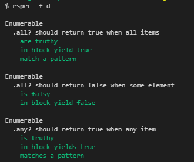

# Enumerable Methods
Exercise was to mimick the building a mixin of the [Ruby Enumerables](https://ruby-doc.org/core-2.6.3/Enumerable.html). 

## Methods Selected
The following methods, from the original API, have been selected for this exercise.

| Method from original API | Custom Version               |
| -------------------------|:-----------------------------|
| ``` all? ```             | ``` my_all? ```              |  
| ``` any? ```             | ``` my_any? ```              |
| ``` count ```            | ``` my_count ```             |
| ``` each ```             | ``` my_each ```              |
| ``` each_with_index ```  | ``` my_each_with_index ```   |
| ``` inject ```           | ``` my_inject ```            |
| ``` map ```              | ``` my_map ```               |        
| ``` none? ```            | ``` my_none? ```             |
| ``` select ```           | ``` my_select ```            |

## Sample code - my_each
```Ruby
# provides an enumeration over items,
# if a block is given - it will be applied to each element
# before returning the enumeration
def my_each
    return to_enum :my_each unless block_given?

    tmp = is_a?(Range) ? to_a : self
    i = 0
    until i.equal? tmp.length
        yield tmp[i]
        i += 1
    end
    self
end
```

The rest is the same for all methods - the custom version should normally not use built in methods from the original API

## RSpec
Sample tests have been added to test teh functionality of these custom methods. Please refer to the spec folder for all tests - each method is covered by one dedicated file of tests. 
Forexample ``` my_all ``` should have a matching file names ``` my_all_spec.rb ```

### Running The Tests
- Ensure that you have ``` Ruby devkit ``` setup on your PC
- Ensure that you have the ``` RSpec gem ``` installed as well
- Clone this repository on your machine and navigate to it
- You can then run the command ``` rspec ``` in the root of the directory

### Sample output from Tests
These tests were run with ``` rspec ``` passing the ``` -f d ``` flags for formatting with documentation. For more options of how to use Rspec please visit the [RSpec online documentation](https://rspec.info/documentation/).


